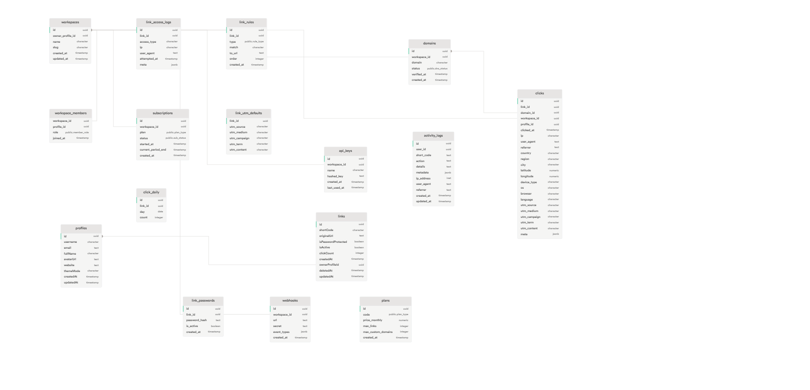

# LinkTrack

A modern, feature-rich link shortening and tracking platform built with Next.js, providing comprehensive analytics, custom domains, and team collaboration features.

## 🚀 Features

- **Link Management**: Create, customize, and manage short links
- **Analytics Dashboard**: Detailed click tracking and performance metrics
- **Custom Domains**: Use your own domains for branded short links
- **Team Collaboration**: Workspace-based team management
- **API Access**: RESTful API for programmatic link management
- **Security**: Password protection and access controls
- **Real-time Analytics**: Live tracking of link performance

## 🗄️ Database Schema

The application uses a comprehensive database schema designed for scalability and feature richness:



### Key Entities:
- **Workspaces**: Team-based organization with member management
- **Links**: Core link shortening with analytics tracking
- **Profiles**: User management and authentication
- **Analytics**: Detailed click tracking with geographic and device data
- **Domains**: Custom domain management and verification
- **Subscriptions**: Plan-based feature access control

## 🛠️ Getting Started

First, run the development server:

```bash
npm run dev
# or
yarn dev
# or
pnpm dev
# or
bun dev
```

Open [http://localhost:3000](http://localhost:3000) with your browser to see the result.

You can start editing the page by modifying `app/page.tsx`. The page auto-updates as you edit the file.

This project uses [`next/font`](https://nextjs.org/docs/app/building-your-application/optimizing/fonts) to automatically optimize and load [Geist](https://vercel.com/font), a new font family for Vercel.
